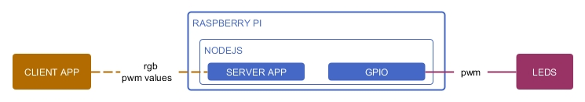
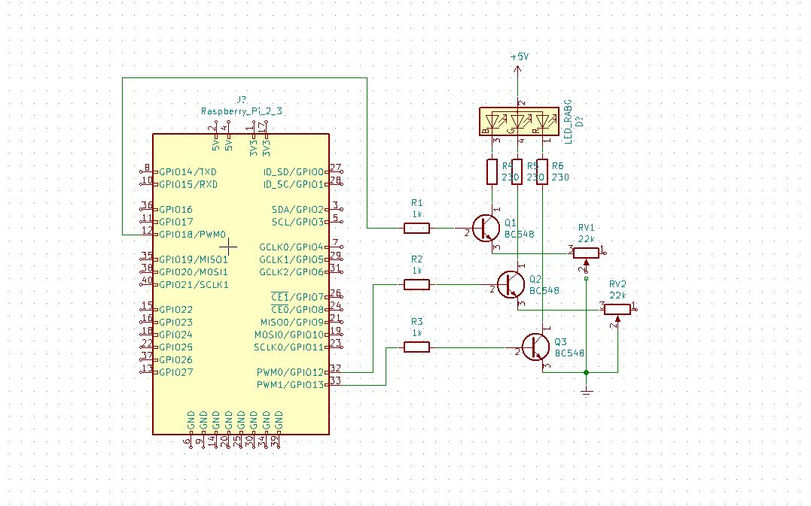

# berry-leds

This project creates a system with which to control some rgb-leds by means of a web in a local network.

## Instalacion
- Instalacion en raspberry de NPM
- Installacion de los paquetes en node
  ```
  cd carpeta/proyecto/src/server_app/
  sudo npm install
  ```
## Uso
- En una terminal, dirigete a [RUTA]  
  ```
  sudo npm run start
  ```
Abre la direccion ip local desde algun navegador-web (mobil o dektop) siempre que estes conectado a la misma red local y el puerto 5000


## Partes

Las partes que foman el sistema son:
- Aplicacion web cliente
- Aplicacion Servidor
- Circuito de leds


### Aplicacion Servidor
Una raspberry en la que corre el servidor basado en Node y Express, y la que controla mediante ancho de pulso la salida dirigida a los Leds RGB mediante el control de GPIO en Node.

#### Servidor
Node y Express como servidor para procesar las peticiones cliente

#### GPIO y Control de Leds
Utiliza el paquete XXX para la comunicacion desde Nodejs con el GPIO de raspberry

- https://www.npmjs.com/package/onoff

##### RGB LEDS
El color de los Leds se controla mediante PWM
- pWM pines de raspberry
- PWM pines por programa

Para el control de multiples se utilizan transistore NPN




### Aplicacion Cliente
Una web envia los datos al servidor con el ancho de pulso para cada canal RGB

#### Simple Version
Utiliza un formulario basico y comunicacion ajax para el envio de peticiones al servidor

#### Version avanzada
Consiste en una aplicacion basada en REACT


## Issues


## Extension

## Links
- https://pythonhosted.org/RPIO/pwm_py.html
- https://www.sohamkamani.com/blog/2015/08/21/python-nodejs-comm/
- https://www.raspberrypi-spy.co.uk/2012/05/install-rpi-gpio-python-library/
- https://tutorials-raspberrypi.com/setup-raspberry-pi-node-js-webserver-control-gpios/
- https://www.instructables.com/id/Using-a-RPi-to-Control-an-RGB-LED/
- https://www.w3schools.com/nodejs/nodejs_raspberrypi_gpio_intro.asp
- https://tutorials-raspberrypi.de/raspberry-pi-nodejs-webserver-installieren-gpios-steuern/
- https://raspberrypi.stackexchange.com/questions/12966/what-is-the-difference-between-board-and-bcm-for-gpio-pin-numbering
- https://github.com/fivdi/onoff
- https://www.raspberrypi.org/documentation/usage/gpio/
- https://www.digikey.com/en/resources/conversion-calculators/conversion-calculator-resistor-color-code-4-band
- https://www.youtube.com/watch?v=UdAnUc7nXYs
- http://c-kolb.bplaced.net/projekte/elektronik/grundlagen/transistor/transistor_npn_pnp.php
- https://tutorials-raspberrypi.de/programmieren-lernen-raspberry-pi-gpio-pwm/
